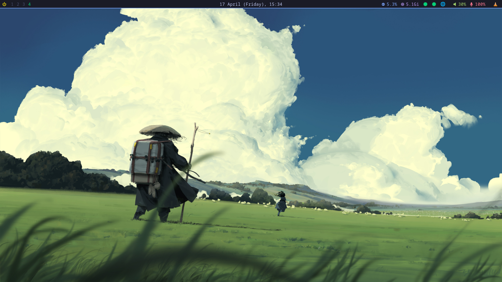
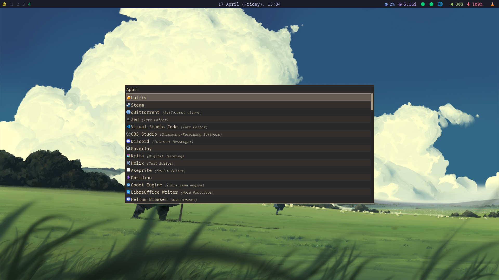
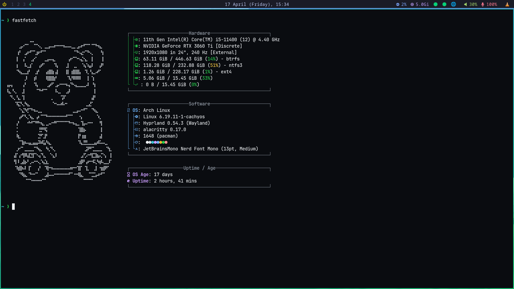

# **My Arch Linux Dotfiles**

*My simple arch linux config/dotfiles*

### Enable Muti-Lib (Needed):

-  Enable `mulitlib` in `etc/pacman.conf`

### ⚠️ Reminder:

`Hyprland` is not installed by default.
If you are freshly installing `Arch Linux` then, I recommend you to install `Hyprland` through the `archinstall` script with the appropriate `GPU Driver` (mine is `Nvidia Propietary Driver` for my `RTX 3060 TI`).  

For Display Manager, select `SDDM` as it works properly. Others also works but if you are new then select that option.

## Full Installation
```
chmod +x full_install.sh
./full_install.sh
```

## Partial Installation
> Install Packages
```
chmod +x scripts/packages.sh
./scripts/packages.sh
```
    
> Symlink Config
```
chmod +x scripts/stowing.sh
./scripts/stowing.sh
```

> Enable Cloudflare-Warp
```
chmod +x scripts/warp_start.sh
./scripts/warp_start.sh
```

> Optional Script
```
chmod +x scripts/commands.sh
./scripts/commands.sh
```

## Screenshots



